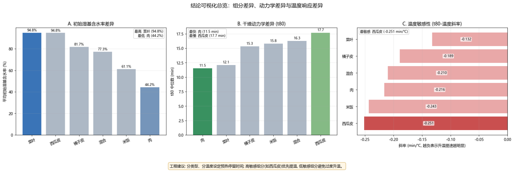
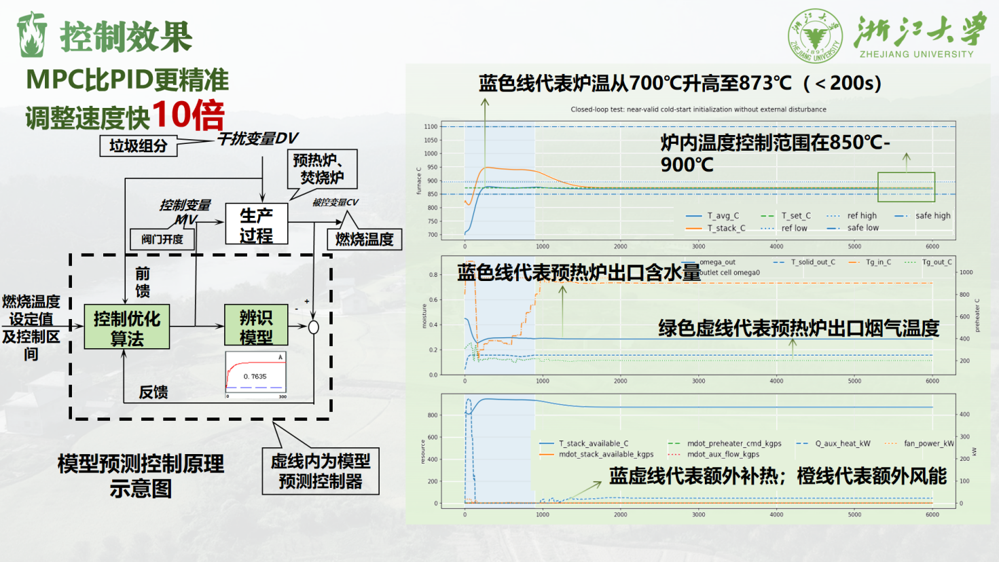
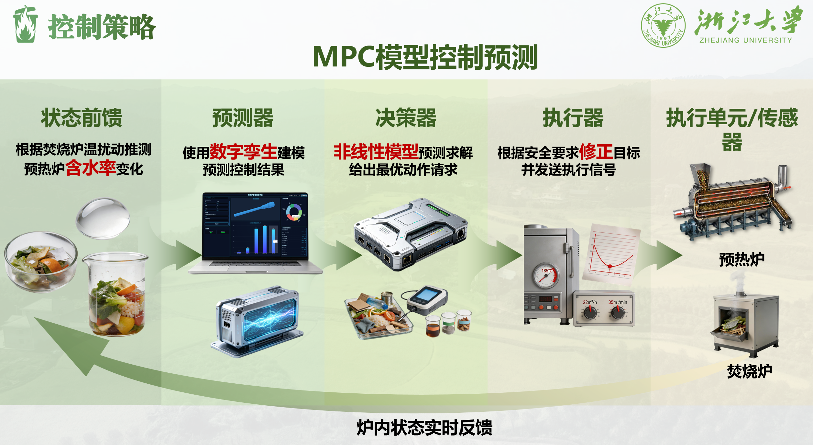
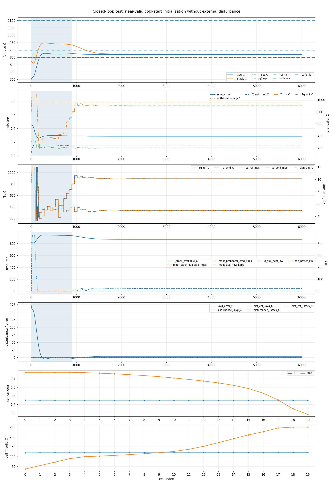
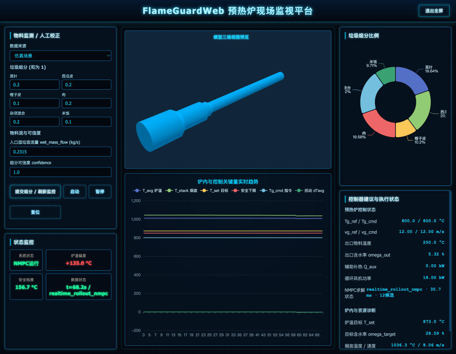

# “稳燃宝”——面向小型垃圾焚烧设施的自适应控温预热系统

## 作品内容简介

本项目针对我国乡镇小型生活垃圾焚烧设施普遍存在的高湿低热值入料、燃烧工况不稳、人工调节粗放、污染物易超标、运维成本高的行业共性痛点，系统性研发了一套面向小型垃圾焚烧设施的自适应控温预热系统。据统计，我国混合生活垃圾厨余占比超55%，整体含水率普遍达50%-70%，入炉热值偏低，而小型焚烧炉存在热惯性小、抗干扰能力弱，极易出现炉膛熄火、温度不达标等问题，现有技术普遍存在“预热不足则干化效果差、预热过度则引发料斗阴燃”的两难困境，且多依赖高额硬件改造，因而难以在基层落地实施。

本作品以我国典型混合生活垃圾为对象，利用垃圾焚烧产生的高温烟气经回流管道对入炉物料进行预热，将物料湿度控制在适宜区间，从而维持焚烧装置的稳定高效运行，形成节能减排的双重效应。通过多因素单变量干燥特性实验，构建垃圾组分占比-预热条件关联数学模型，研发自适应预热控制方案：输入垃圾组分与占比，系统即可自动匹配最优烟气温度与烟气流速，实现入炉垃圾精准干化，同时系统内置多重安全防护机制，采用轻量化模块化设计，无需对焚烧炉主体设备进行改造，即可从源头保障焚烧炉稳定燃烧，操作门槛低，完美匹配基层运维能力。

经理论核算与多工况验证，本方案能有效提升垃圾入炉热值，针对20t/d规模的乡镇焚烧炉，年节约辅助柴油227.5吨，CO₂减排704.1吨，二噁英生成量降低90%以上，年节约运行成本超190万元，为小型焚烧设施提标改造提供了低成本、易落地的解决方案，深度契合国家“双碳”战略与乡村环保治理要求。

关键词：小型垃圾焚烧；自适应控温；预热干化系统；高湿生活垃圾；稳燃技术；

## 1 研制背景及意义

在国家生态文明建设、乡村振兴战略与“双碳”目标的深度驱动下，完善农村生活垃圾无害化处理体系，已成为补齐乡村环境基础设施短板、推动城乡绿色低碳均衡发展的核心任务之一。当前我国城镇生活垃圾无害化处理体系已趋于成熟，处理率达99.2%，焚烧处理能力达58万吨/日，基本实现城市与县城生活垃圾的全量无害化处理[1]，但城乡垃圾处理发展不平衡的问题依然突出，乡村地区垃圾处理仍存在显著的结构性短板[2] ，与城市的生活垃圾排放情况相比，农村生活固体垃圾排放量增长更快[3]。我国乡村生活垃圾以高湿厨余垃圾、农业废弃物为主要组分，整体含水率普遍在50%-70%之间，厨余占比超55%，根据生活垃圾焚烧行业通用规律，垃圾含水率每升高1%，湿基低位热值便降低118.7kJ/kg[4]，这也导致乡村原生垃圾湿基低位热值普遍不足3500kJ/kg，远无法达到《城市生活垃圾处理及污染防治技术政策》规定的5000kJ/kg自持燃烧最低阈值[5]，无法满足焚烧炉稳定运行的基础要求。受乡村地区人口分布分散、收运半径大的客观条件限制，日处理5-20t的小型焚烧炉是乡村垃圾就地就近处理性价比最高的装备选择，但此类炉型热惯性极小，对入炉垃圾的热值、含水率波动敏感度极高，低热值、高水分的原生垃圾直接入炉，极易引发炉膛温度剧烈波动、频繁熄火，进而造成黑烟、CO、二噁英等污染物超标排放，难以满足环保管控要求。当前行业内针对高湿垃圾的预热预处理技术，始终未能破解核心两难困境：低温预热无法实现有效脱水，难以达到焚烧稳燃的热值要求；高温预热则易引发垃圾提前碳化、料斗阴燃着火，存在显著安全隐患，且现有技术多为人工经验式的粗放操作，缺乏针对不同垃圾组分的自适应调节能力，无法将复杂多变的乡村垃圾稳定预处理至适宜入炉的状态，难以在基层场景落地。与此同时，乡村地区普遍缺少专业的环保运维技术人员，现有的预处理系统与智能焚烧装置运维门槛高，导致大量已建成的小型焚烧设施无法实现稳定规范运行，普遍陷入“建得起、运不好、修不起”的恶性循环，与国家乡村环境治理的目标要求存在显著差距。

当前，国家出台的多项政策文件为乡村垃圾处理技术创新与设施升级规定了明确方向与硬性要求。国务院办公厅印发的《“十四五”城镇生活垃圾分类和处理设施发展规划》明确提出，要推动县级地区生活垃圾焚烧处理设施覆盖范围向建制镇和乡村延伸，重点推进既有焚烧设施提标改造与小型焚烧设施试点示范；《生活垃圾焚烧污染控制标准》（GB18485-2014）也作出强制规定，要求焚烧炉炉膛主燃区温度需稳定维持在850℃以上[6]，烟气停留时间不低于2秒，从环保层面划定了焚烧稳燃的硬性红线。据行业公开统计数据，截至2025年底，我国已建成投运的乡镇级小型生活垃圾焚烧设施超1200座，且每年仍有数百座新增设施落地，其中90%以上的在运设施均面临稳燃难、运维难、达标难的核心痛点，当前市场中适配乡村基层场景、低成本、低运维门槛、可破解预热技术核心困境的专属解决方案供给严重不足，刚性市场需求与技术供给缺口之间的矛盾突出，仍存在广阔的技术提升与推广空间。

如上所述，在国家政策强力引导、乡村垃圾处理需求迫切、现有技术存在明显短板的三重背景下，开展乡村垃圾预处理技术研究与装备开发，不仅具有重要的理论价值和实践意义，也是响应国家战略需求、推动产业技术进步的重要举措。

本项目旨在通过技术创新，从以下三个维度缓解小型焚烧炉运行不稳定、污染物排放不达标、运维难度大等行业痛点，进一步完善乡村垃圾处理体系，为实现双碳目标做出贡献。

### 1）节能：降低化石燃料依赖，缓解运营压力

本项目研发的预处理装置可使垃圾含水率稳定下降，显著提升入炉垃圾低位热值，使其满足5000kJ/kg标准，大幅减少柴油、天然气等化石辅助燃料的使用，间接缓解乡村垃圾处理的资金压力，契合双碳战略中降低化石能源消耗的核心要求，提升生物质能源利用率。

### 2）减排：稳定燃烧状态，降低污染物排放

本项目预处理装置通过精准调控垃圾温度、湿度等关键指标，确保入炉垃圾状态均匀稳定，保障炉膛温度持续维持在国家标准文件要求的850℃以上，延长烟气停留时间，有效抑制污染物生成和排放，解决小型生活垃圾焚烧装备烟气处理不达标问题。

### 3）延寿：减少设备损耗，保障长效运行

本项目通过标准化预处理工艺，为焚烧炉提供稳定均一的进料，显著减轻热冲击对炉膛的损害，延长小型焚烧炉使用寿命，缓解乡村地区“建得起、运不好”的运维难题，保障小型焚烧设施长期稳定运行，为乡村垃圾无害化处理模式落地提供坚实支撑。

## 2 技术路线

本项目以破解乡镇小型垃圾焚烧炉高湿低热垃圾稳燃难的核心痛点为目标。技术路线图详见附件2首先通过系统的多因素单变量干燥特性实验，探明不同加热条件下乡村典型生活垃圾的干燥规律，构建垃圾组分与干燥特性的专属数据库，为控制方案奠定核心数据基础；其次基于实验数据库，研发“实验数据规则匹配+PID动态修正”的自适应预热控制算法，实现不同垃圾组分工况下烟气流速与温度的精准匹配，同时内置多重安全防护机制，破解预热不足与预热过度的行业两难困境；随后依托COMSOL Multiphysics多物理场平台，搭建干燥预热 - 炉膛稳燃全耦合仿真架构，完成多典型工况下方案适用性与稳燃效果的闭环验证与参数优化；最终通过系统的理论核算，量化方案的节能、减排、碳减排与综合经济效益，形成一套低成本、无硬件改造、易运维、可快速复制的乡镇小型焚烧炉预热稳燃解决方案。

## 3 设计方案

面向小型垃圾焚烧设施的自适应控温预热系统 “稳燃宝”，是针对我国乡村地区生活垃圾含水率高、组分波动大、小型焚烧设施燃烧不稳定、能耗偏高、污染物易超标等痛点研发的一体化解决方案。系统以预热炉装备、自适应控制系统、前端智能操控平台为三大核心构成，依托完整实验支撑与模型验证，通过预热脱水、精准控温、智能调控协同作用，实现垃圾稳定燃烧、能源高效利用与污染物减排。本说明书对系统整体架构、装备设计、控制逻辑、实验依据与操作使用进行系统性阐述，完整呈现技术成果与工程应用方式。

### 3.1 预热炉结构设计与工作原理（设计思路详见附件6）

预热炉为系统核心执行装备，采用卧式回转筒体式结构，以焚烧炉高温烟气作为热源，在垃圾进入焚烧炉前完成可控预热脱水，提升低位热值并保障稳定燃烧。炉体外部包覆高性能保温层，降低热量散失；内部沿周向均匀布置六根内置导烟管，配合外夹套形成双通路换热结构，显著增大换热面积与传热效率。筒体由回转支承与驱动机构带动低速旋转，使垃圾在筒体内连续翻动、均匀受热，避免局部堆积、干燥不均或局部过热。

设备两端分别设置密封式进料口与出料口，保证连续稳定运行；炉体预留标准化测温、测压、测流接口，配套清灰、排水与检修结构，满足长期运维与安全监测需求。整体设计遵循低温高效脱水、不碳化、无提前着火原则，可将垃圾含水率稳定控制在最优燃烧区间，实现预热与焚烧的能量梯级利用，适配 20t/d 级小型垃圾焚烧设施新建配套与现有设备改造。

### 3.2 核心实验基础与数据支撑

本系统全部设计参数均来自自主搭建的垃圾干燥实验平台，通过多工况干燥实验建立完整数据体系（具体实验见附件3），为预热温度、控制策略、结构优化提供科学依据。实验采用0.1℃高精度烘箱与0.001g 高精度电子天平，对菜叶、西瓜皮、橙皮、肉类、混合垃圾等乡村典型组分开展全因子实验，测得初始含水率、干燥速率、温度敏感性等关键特性。实验结果表明：菜叶初始含水率高达 94.8%，肉类仅 44.2%；西瓜皮干燥最慢，肉类干燥最快；不同组分温度敏感性差异显著。基于上述实验结果，团队构建垃圾组分–干燥特性关联数据库，为自适应控制提供精准输入，确保系统面对波动工况仍可稳定匹配最优预热参数。

图1 结论可视化分析：组分差异、动力学差异与温度响应差异

### 3.3 自适应控制系统组成与运行逻辑（设计思路详见附件5）

自适应控制系统为预热炉提供全流程智能决策与精准执行能力，采用 MPC 模型预测控制架构，解决垃圾组分多变导致的控制滞后、精度不足等问题。系统自上而下分为数据感知层、模型决策层、执行控制层，形成闭环控制体系。

图2 MPC 模型预测控制架构

数据感知层通过传感器实时采集炉温、烟气流速、垃圾组分、含水率等运行参数，并接收焚烧炉反馈信号，为控制决策提供依据。模型决策层依托实验建立的垃圾组分–干燥特性关联数据库，结合预热脱水模型、焚烧稳燃模型与 COMSOL 多物理场仿真结果，通过非线性多目标三级优化算法，以入口烟气温度、烟气流速为控制变量，在满足停留时间、供热能力、安全温度等约束条件下，依次实现含水率逼近目标值、燃烧状态均匀化、系统能耗最小化。执行控制层根据最优决策自动调节阀门开度、供热强度与筒体转速，以前馈 + 反馈协同方式快速响应工况波动。

图3 MPC模型控制预测结构图

系统严格遵循国标要求，将炉膛温度稳定控制在850℃–900℃，确保二噁英充分分解；冷启动至稳态时间小于 200 秒，控制响应速度较传统 PID 提升约 10 倍，实现高效、稳定、低碳运行。

图3 冷启动闭环控制效果

### 3.4 前端智能控制平台操作与使用说明

前端智能控制平台为可视化人机交互界面，面向乡村基层运维人员设计，具备操作简洁、参数直观、模式智能等特点，实现预热系统全流程监视、控制与管理。平台集成六大核心功能模块：垃圾组分设定、炉内状态实时监视、炉膛 3D 模型预览、运行参数展示、计算监控与结果修正、节点温度对比。

使用时，操作人员可在组分设定界面输入菜叶、西瓜皮、橙子皮、混合垃圾等比例数据；系统自动完成优化计算并下发控制指令。运行参数区实时显示平均炉温、烟气温度、烟气流速、物料温度、目标含水率等关键指标；计算监控模块自动完成约束核验、优化结果输出与偏差跟踪，支持自动 / 手动模式切换。节点温度柱状图实时呈现关键点位温度分布，便于工况判断与异常预警。平台支持全自动反馈运行，大幅降低人工干预频率，提升系统稳定性与易用性，满足乡村小型垃圾焚烧设施长期可靠运行需求。

图4 监控平台前端页面

## 4 效益评估

以国内主流的日处理20t乡镇小型生活垃圾焚烧炉为核算基准，结合项目干燥特性实验结果与生活垃圾焚烧行业通用设计参数，对本自适应预热控制方案的节能减碳、污染物减排及综合经济效益开展系统量化核算。所有核算结果均基于单炉满负荷、全年365天连续运行的理论工况得出。

经核算，本方案通过预热干化处理可将原生垃圾湿基低位热值提升约38%，有效填补了高湿原生垃圾与自持燃烧阈值之间的核心热值缺口，大幅削减焚烧炉辅助燃料消耗量，应用于20t/d规模乡镇焚烧炉时，可将0号柴油日消耗量由704.2kg降至80.9kg，全年可节约0号柴油227.5吨，显著降低焚烧炉助燃能耗；基于化石燃料消耗量的削减，本方案全年可实现CO₂减排704.1吨，有效降低乡镇生活垃圾处理环节的碳排放强度，深度契合国家“双碳”战略发展要求。

在污染物管控方面，本方案可使焚烧炉主燃区温度稳定，既满足了生活垃圾焚烧污染控制的国标强制要求，也从源头实现了特征污染物的有效抑制，全年可减排二噁英0.036g TEQ，排放强度稳定控制在国标限值0.1ng TEQ/Nm³以内，较不稳定燃烧工况减排幅度达90%以上；同时炉温稳定大幅提升了垃圾燃烧完全度，有效减少了不完全燃烧产物的生成，全年可减排一氧化碳61.32吨，显著降低了焚烧设施的污染物排放负荷。

经济效益层面，本方案为纯软件化控制升级方案，无需对焚烧炉主体设备进行硬件改造，前期投入极低，核心收益来自燃料成本与运维成本的双重节约。其中，按柴油市场均价8000元/吨计算，全年节约柴油对应燃料成本节约达182万元；同时炉温长期稳定消除了频繁熄火、炉膛热冲击带来的耐火材料损耗与设备检修成本，可降低15%的运维成本，全年运维成本节约约11万元，综合核算下来，单台20t/d规模焚烧炉应用本方案后，全年可节约综合运行成本约193万元，前期投入可在极短周期内完全收回，具备极强的经济效益与商业推广价值。

## 5 创新点

本产品所研究的主要内容，主要的创新点有：

1）数据驱动控制：基于自主干燥实验，首次建立一个精准的组分-参数直接映射模型。基于实际垃圾组分实时输出最优预处理方案，告别人工凭经验判断的主观性与滞后性，实现预处理过程的智能化控制。

2）仿真闭环验证：构建垃圾预处理仿真体系，提前验证预处理方案对焚烧炉稳燃效果的提升作用。在工程落地前识别潜在风险，优化参数设置，降低实体实验与设备改造的试错成本，缩短项目落地周期。

3）自适应匹配：研发自适应控制算法，根据输入的垃圾组分占比等基础信息自动计算并输出最优烟气流量与物料停留时间组合，适配全工况场景。

## 6 应用前景

1）适用场景广泛：适配全国乡镇小型垃圾焚烧炉，针对中西部偏远镇村处理资源不足的需求，可直接配套新建设施。同时可应用于既有小型焚烧炉的智能化升级，无需大规模改造设备本体，通过控制模块加装即可实现性能提升。

2）落地优势显著：加装无需额外增加高额硬件投入，实现低成本升级；部署流程简单，基层工作人员无需专业技术背景即可操作，契合乡镇运维现状。搭配仿真闭环验证机制，护航项目落地，打破技术门槛限制，助力政策要求在基层有效落地。

3）市场价值高：我国乡镇小型焚烧设施存量庞大，且“十四五”规划明确推动县级地区焚烧设施向乡村延伸，市场需求持续释放。本项目提供的低成本、易部署、高适配的控制方案，可快速响应存量设施升级与新建项目配套需求，推广潜力巨大，对完善乡村垃圾处理体系具有重要意义。

## 参考文献

1.  中华人民共和国国务院.“十四五”城镇生活垃圾分类和处理设施发展规划[M]. 北京：中华人民共和国国务院,2021.

2.  中华人民共和国住房和城乡建设部.对十四届全国人大第二次会议第5021号建议的答复 (建城函〔2024〕84 号)[EB/OL]. 北京:中华人民共和国住房和城乡建设部,2024.

3.  蒋培,胡榕.农村生活垃圾分类存在的问题、原因及治理对策[J.学术交流2021(2):146-156.

4.  李剑颖.基于多元线性回归的生活垃圾热值影响因素分析[J].环境卫生工程,2019,27(4): 35-40.

5.  中华人民共和国住房和城乡建设部,国家环境保护总局,科学技术部.城市生活垃圾处理及污染防治技术政策(建城〔2000〕120号)[M].北京：中华人民共和国住房和城乡建设部,2000.

6.  中华人民共和国环境保护部,中华人民共和国国家质量监督检验检疫总局.生活垃圾焚烧污染控制标准 (GB 18485-2014)[S]. 北京:中国环境科学出版社,2014.
